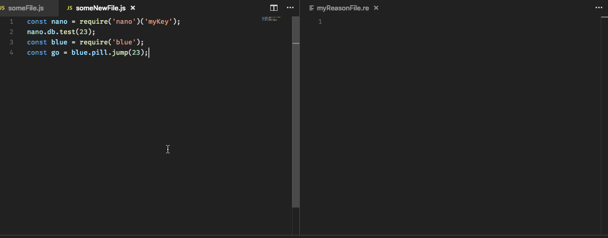

# :on: Rebind

Experimental automated generation of Reason/BuckleScript bindings from JavaScript code.

## Status

Rebind is in very early stages. While a few BuckleScript attributes have some minimal support (`[@mel.obj]`, `[@mel.send]`, `[@mel.module]`, ...), the range of JavaScript expressions that are not covered is still quite large (see table below).

## Why

This JavaScript code:

```javascript
const nano = require("nano")("http://localhost:5984");
nano.db.create("foo", (err, body, headers) => {
  console.log(err);
});
```

Requires roughly the following bindings in Reason to be generated:

```reason
type nano;
type err;
type body;
type headers;
type db;
type create;
[@mel.module] external nano : string => nano = "";
[@mel.get] external db : nano => db = "";
[@mel.send]
external create : (db, string, (err, body, headers) => unit) => create = "";
```

The process of creating bindings is a core part of introducing Reason / BuckleScript into existing JavaScript applications. However, this binding creation is a non-trivial process, and it might become a time consuming activity over time. Plus, it requires remembering the different BuckleScript attributes for each case, which, at least in my experience, has been challenging.

Rebind is an attempt to help easing this process by parsing JavaScript code, and generating as many bindings as possible based on the available syntactic information.

Over time, Rebind might become a way of coding "best practices" when it comes to write bindings, depending on the community consensus for each particular case.

Potentially, at some point in the future, Rebind could be integrated with editor extensions, allowing for easier migration of JavaScript apps to Reason / BuckleScript:



## Install

1. From your terminal:
```bash
git clone https://github.com/jchavarri/rebind
npm install -g .
```
1. Rebind needs `refmt` to output the Reason/OCaml code, so you will have to follow the instructions from the [official Reason docs](https://reasonml.github.io/docs/en/global-installation.html) to get it installed.

## Running

From the terminal:

`rebind yourFile.js | refmt --parse binary --print re`

Rebind also supports passing some input JavaScript in stdin, like so:

`echo "var t = {a:2}" | rebind`

---

## How does it work

Rebind analyzes the JavaScript syntax tree from a given piece of JavaScript code and tries to generate an OCaml syntax tree that defines bindings to the expressions the JavaScript code contains.

This derivation can be very accurate at times, (whenever many literals are used) but in general it will be a best effort approach. If your code uses a lot of variables which value is defined outside the code being analyzed, Rebind will "fill the gaps" using opaque types.

For example, this JavaScript code:

```javascript
const result = something.awesome("test");
```

```reason
type something;
type awesome;
[@mel.module] external something : something = "";
[@mel.send] external awesome : (something, string) => awesome = "";
```

As you can see, `something` is inferred to be an external module, and a companion opaque type is created for it.

## Expressions supported

**Legend**
- :egg: no support yet / unclear
- :hatching_chick: some basic support
- :chicken: full support

Expression Name | Binding(s) generated | Status
------------ | ------------- | -------------
Function | None, it iterates over params to get identifiers | :hatching_chick:
ArrowFunction | None, it iterates over params to get identifiers | :hatching_chick:
Identifier | `[@mel.module]` | :hatching_chick:
Literal | None, return types for bindings to be used | :hatching_chick:
Call | `[@mel.module]` or `[@mel.send]` | :hatching_chick:
Member | `[@mel.get]` | :hatching_chick:
Object | `[@mel.obj]` | :hatching_chick:
This | - | :egg:
Super | - | :egg:
Array | - | :egg:
Sequence | - | :egg:
Unary | - | :egg:
Binary | - | :egg:
Assignment | - | :egg:
Update | - | :egg:
Logical | - | :egg:
Conditional | - | :egg:
New | - | :egg:
Yield | - | :egg:
Comprehension | - | :egg:
Generator | - | :egg:
TemplateLiteral | - | :egg:
TaggedTemplate | - | :egg:
JSXElement | - | :egg:
Class | - | :egg:
TypeCast | - | :egg:
MetaProperty | - | :egg:


## Frequently asked questions

#### Does this support JSX / other fancy syntax features?

Probably not. See the table above.

#### Can I use this with VSCode or my editor of choice?

Not yet, but there are proof of concepts like shown in the GIF above that are being explored, and it could be possible at some point in the future.

#### Can I use it from Node / the browser?

Not yet, but it should be possible. It "just" needs to be compiled together with `refmt`, as both tools need to share the binary representation of OCaml / Reason syntax tree.

#### How can I contribute?

* Report bugs
* Provide examples of JavaScript code + bindings that you'd like to see generated (you can do so by creating a PR with a failing test)
* Open discussion issues to debate what kind of bindings we could generate from some of the expressions from the table above

## Acknowledgements / preliminary work

#### Jeason

Rebind is more than influenced by Jeason. It was originally a fork of that project, but at some point it became more and more obvious that the original vision of Jeason is much more ambitious, and those differences made hard to conciliate both projects at the technical level. Rebind wouldn't be possible without Jeason and the work @chenglou did. :sparkles:

#### Flow

As Jeason, Rebind contains a vendored version of the Flow parser, which allows to generate the JavaScript syntax tree.

#### JavaScript to ReasonML transpiler

Another influence for this project has been the [JavaScript to ReasonML Transpiler](https://github.com/emnh/js-to-reasonml-transpiler) by Eivind Magnus Hvidevold, that takes a different approach by running the JavaScript code at runtime and getting the type information there. This allows to get much better accuracy than Rebind, at the cost of a heavier footprint due to these runtime constraints.
